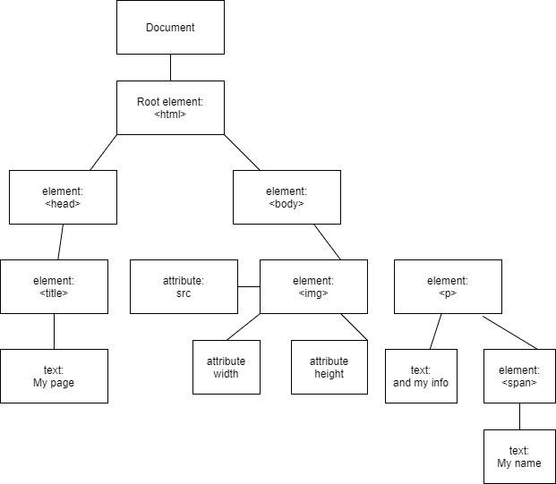

# Michael Ortega 
## id: orte6652

## Part 1 

 1.  Four ways of applying css into HTML:
	 ### 1a. 
	    * Using the style attribute
	    * Using the ID as selector
	    * Styling by class name
	    * Styling by html element
	   The precedence goes from attribute, id, class, and html element.
	 ### 1b.
		 Padding is the inner layer of the box model. Padding is use for
		 specifying the distance of the content from the border. On the
		 other hand margin is the outer layer of the box model. Margin is
		 use to specify the distance from other html elements. 
### 2a. 
	!== only compare if the values are the same.
	While !=== compares if the value and dataType are
	same.
### 2b. 
		statment has the value of false
### 3.
	[1, 2]
	[1, 2]
### 4.

